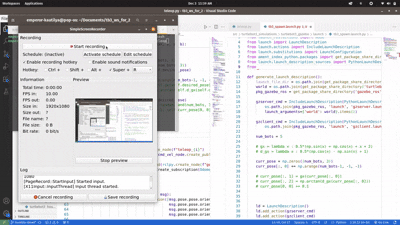

= Robot-Conga
Robot Conga: A Leader-Follower Walking Approach to Sequential Path Following in Multi-Agent Systems

---

== 📄 Paper

The research paper describing this project is available on arXiv:  
https://arxiv.org/abs/2509.16482[Robot Conga: A Leader-Follower Walking Approach to Sequential Path Following in Multi-Agent Systems]

---

== 🔎 Overview

*Robot-Conga* is a framework for studying **leader–follower sequential path following** in multi-agent robotic systems.  
The project explores coordinated locomotion where one or more leader agents define a trajectory, and follower agents dynamically adjust to maintain a "conga line" formation.  

Applications include:
- Swarm robotics
- Multi-agent coordination
- Reinforcement learning
- Path planning and following

---

== 📁 Codebases

The project is split into two main repositories:

- 🐢 **TurtleBot3 (ROS + Gazebo)**  
  ROS-based simulation of the leader–follower approach using TurtleBot3 robots in Gazebo.  
  🌐 https://github.com/Tiwari-Pranav/Robot-conga-turtlebot3-ros-gazebo[Robot-Conga TurtleBot3 ROS/Gazebo Codebase]

- 🐾 **Quadruped (PyBullet)**  
  Physics-based quadruped robot convoy simulation in PyBullet.  
  🌐 https://github.com/Tiwari-Pranav/Robot-conga-quadruped-pybullet[Robot-Conga Quadruped PyBullet Codebase]

---

== 🎥 Demo

image::resources/gif/QUADRUPED_CONVOY.gif[Quadruped Leader-Follower Simulation, width=600, align=center]

---

== 🚀 Getting Started

To reproduce the results or run simulations, please refer to the instructions in each repository:

- link: https://github.com/Tiwari-Pranav/Robot-conga-turtlebot3-ros-gazebo[ROS/Gazebo (TurtleBot3)]
- link: https://github.com/Tiwari-Pranav/Robot-conga-quadruped-pybullet[PyBullet (Quadruped)]

---

== 🤝 Contributing

Contributions, issues, and feature requests are welcome!  
Please use the respective repository issue trackers to report bugs or suggest features.

